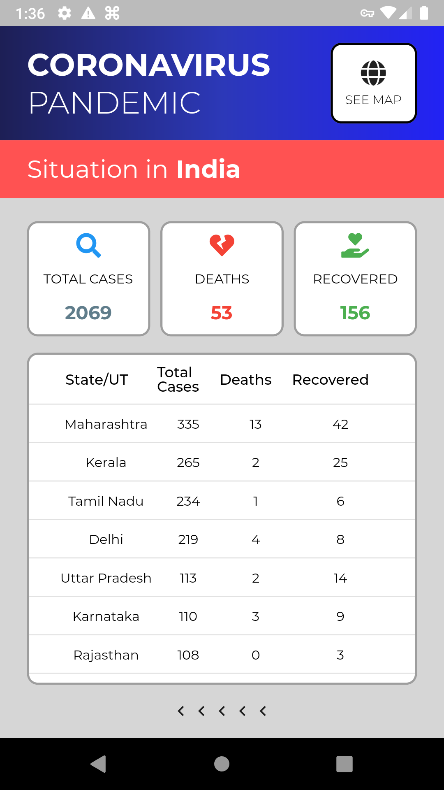
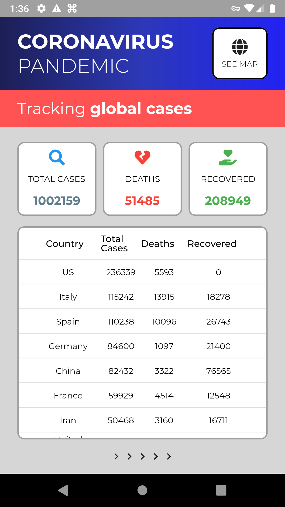
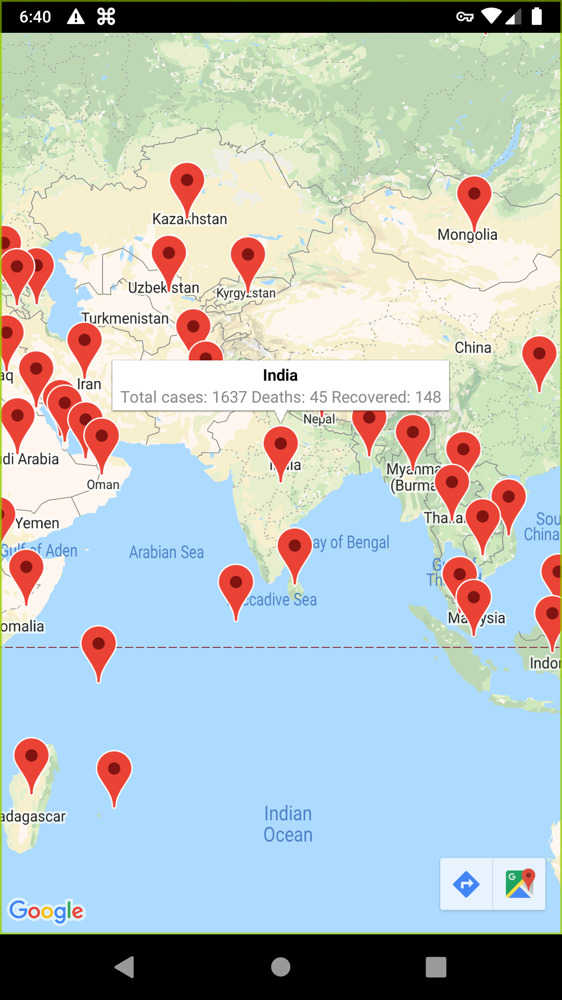

# COVID-19 Tracker

An app to keep count of number of coronavirus patients all around the world. The app was made using flutter. Currently only android devices are supported.

 ## Download apk

  

## Features
* Counts of people with COVID-19 around the world.
* Number of people in India with COVID-19.
* Google Map which has markers on all countries which has COVID-19.
* Uses Bloc Pattern for State Management.
  
The app takes data from these APIs:  
World Data: [https://covid19.mathdro.id/api]()  
India states data: [https://api.rootnet.in/covid19-in/stats/latest]()

## Screenshots

<table>
  <tr>
    <td>India's Situation</td>
     <td>Global Count</td>
     <td>Map</td>
  </tr>
  <tr>
    <td></td>
    <td></td>
    <td></td>
  </tr>
 </table>

